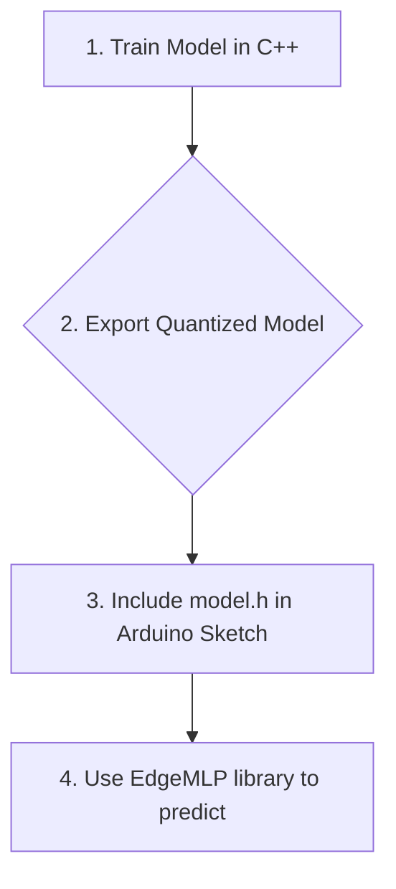

# EdgeMLP: Train MLPs in C++, Deploy to the Edge


**EdgeMLP** is a lightweight, dependency-free C++ library for training Multi-Layer Perceptron (MLP) neural networks and deploying them to resource-constrained edge devices like Arduino.

The project is divided into two main parts:
1.  **Training Application (C++)**: A command-line application to define, train, and save neural network models.
2.  **Inference Library (Arduino)**: A highly optimized Arduino library for running trained models on microcontrollers with limited memory.

[](https://github.com/filippo/EdgeMLP)
[](LICENSE)
[](https://github.com/filippo/EdgeMLP/releases)

---

## ✨ Key Features

### 🏋️ Training Application (Desktop)
- **Pure C++17**: Modern, fast, and with no external dependencies.
- **Matrix Library from Scratch**: All necessary operations for neural networks.
- **Activation Functions**: `Sigmoid`, `ReLU`, `Tanh`, `Linear`.
- **Weight Initialization**: `Xavier/Glorot` and `He` for stable training.
- **Backpropagation**: Full training algorithm implemented.
- **Cost Functions**: Mean Squared Error (MSE) with its derivative.
- **Model Export**: Saves trained models in a compact binary format and exports them to a quantized (`int8`) Arduino header.

### 🤖 Inference Library (Arduino/Edge)
- **Ultra-Lightweight**: Designed to run on devices with as little as **2KB of RAM** (e.g., Arduino Nano).
- **`int8` Quantization**: Drastically reduces model size and memory usage.
- **Flexible Model Loading**: Supports both compile-time models (via `PROGMEM`) and dynamic models loaded Over-The-Air (OTA) or from an SD card.
- **Simple API**: Load a model and run predictions with just a few lines of code.
- **High Performance**: Fast integer math and lookup tables for activation functions.
- **Compatibility**: Supports a wide range of boards, including Arduino AVR (Uno, Nano) and ESP32.

##  workflow Workflow

The process from training to prediction is simple and straightforward:

1.  **Define & Train (C++)**: Use the desktop application to create a network architecture and train it on your data (e.g., an XOR problem).
2.  **Export**: The training application generates a header file (`.h`) for Arduino. This file contains the quantized model as a byte array.
3.  **Include & Load (Arduino)**: Include the generated header in your Arduino sketch.
4.  **Predict (Arduino)**: Use the `EdgeMLP` library to load the model from flash memory and run real-time inferences.



## 🚀 Project Status

This project is under active development. The goal is to create a complete ecosystem for machine learning on embedded devices.

- **Part 1: Training Application**: In progress.
- **Part 2: Arduino Library**: Planned.

## 🛠️ Installation and Build

### Prerequisites
- A C++17 compiler (e.g., GCC, Clang)
- CMake (version 3.10 or later)

### Build the Training Application
```bash
git clone https://github.com/filippo/EdgeMLP.git
cd EdgeMLP
mkdir build && cd build
cmake ..
make
```
The `trainer` executable will be available in the `build/src/training` directory.

## 🤝 Contributing

Contributions are welcome! If you want to contribute, please open an issue to discuss your ideas or submit a pull request.

## 📄 License

This project is released under the **MIT License**. See the [LICENSE](LICENSE) file for more details.
