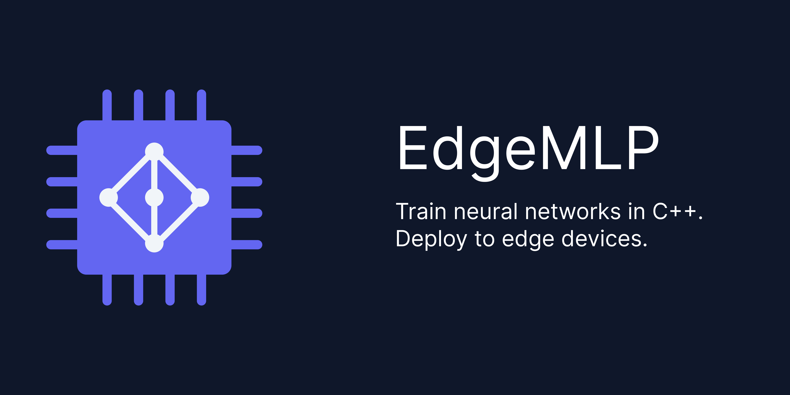

# EdgeMLP


Lightweight, dependency-free C++ library to design and train Multi-Layer Perceptrons (MLPs) on desktop and deploy quantized `int8` models to resource-constrained MCUs (e.g. Arduino, ESP32, AVR).

[](https://github.com/Fb1234566/EdgeMLP/actions/workflows/tests.yml) [](LICENSE) [](https://github.com/Fb1234566/EdgeMLP)

Why EdgeMLP
- Extremely compact, no external dependencies.
- Target devices with limited resources.
- End-to-end workflow: design and train MLPs in `C++`, export a quantized model, and deploy directly to MCUs.

Key Features

Training (desktop)
- Pure `C++17`, portable.
- Built-in matrix library and training utilities.
- Activation functions: `Sigmoid`, `ReLU`, `Tanh`, `Linear`.
- Weight initializations: `Xavier/Glorot`, `He`.
- Save and export quantized models (`int8_t`).

Inference (edge)
- `int8` quantized models to minimize footprint and speed up inference.
- Support for embed via `PROGMEM` or dynamic loading (OTA / SD).
- Compatibility: TBD.

Project status
- Training library (`C++`): in active development.
- Inference runtime (Arduino): design phase.
- Goal: complete the training application.

Quickstart — build the training app

Prerequisites:
- `g++` or `clang++` with `C++17` support
- `CMake` >= 3.10
- `make` (or equivalent build tool)

Build example:
```bash
git clone https://github.com/Fb1234566/EdgeMLP.git
cd EdgeMLP/src/training
cmake -S . -B build
cd build
make
```
The `EdgeMLP` executable will be available in `EdgeMLP/src/training/build`.

Contributing
- Open an issue to discuss features or bugs.
- Pull requests welcome; include tests and documentation.
- Follow `C++17` style and add unit tests for new features.

License
- MIT — see `LICENSE`.

Contact
- Repository: https://github.com/Fb1234566/EdgeMLP
- For questions or status updates, open an issue on the repository.